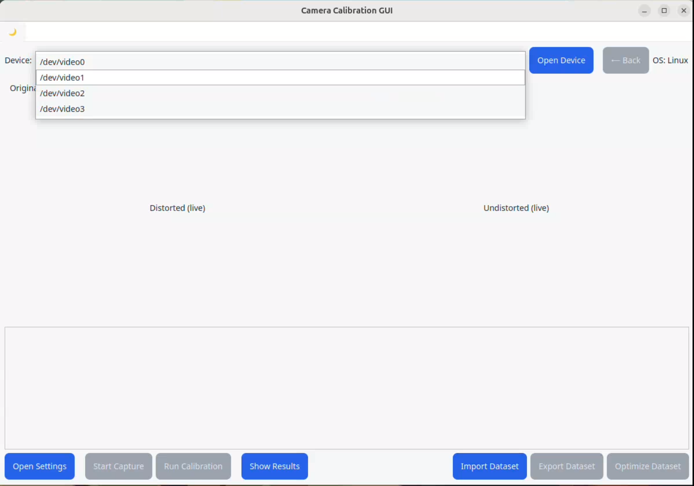
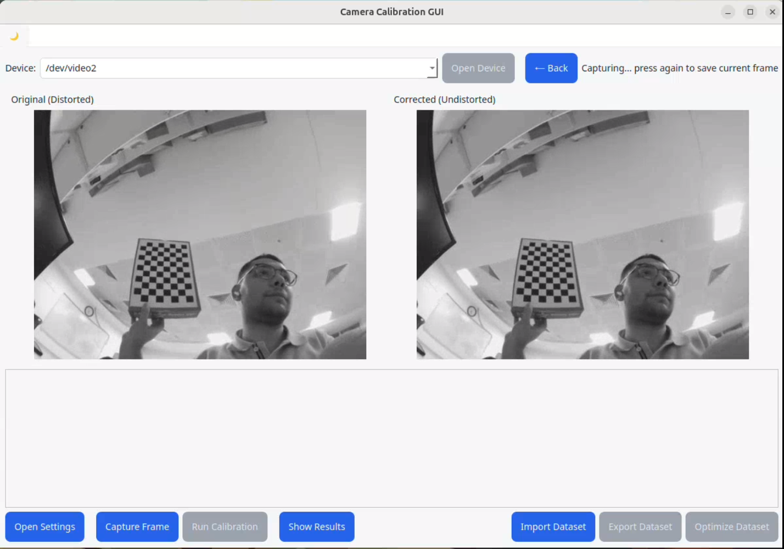
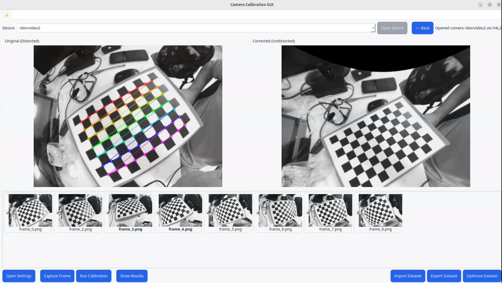
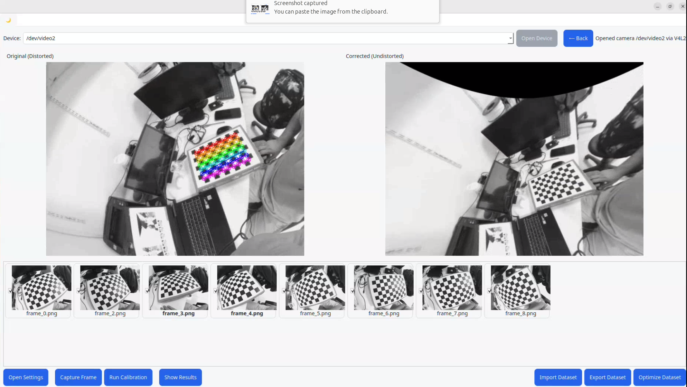
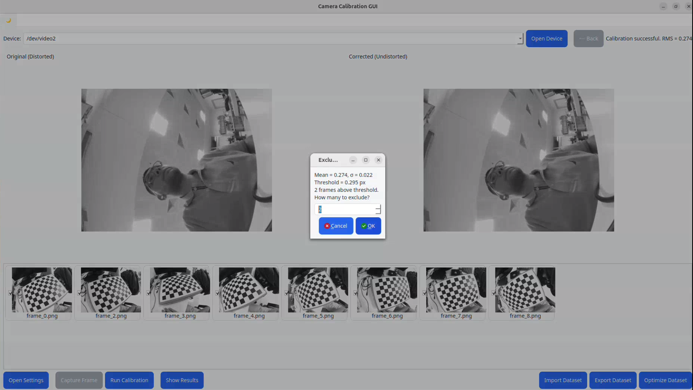
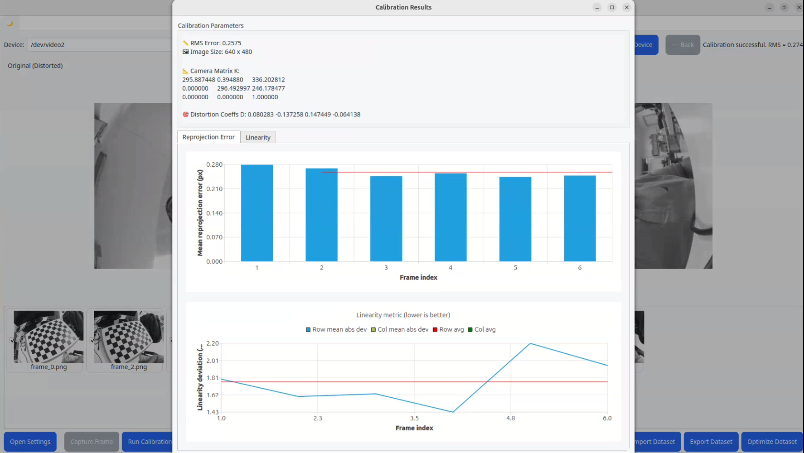
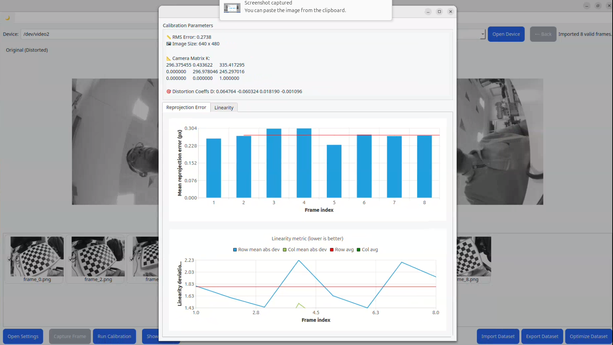

# Camera Calibration GUI

Camera Calibration GUI is a desktop application for managing the full camera calibration workflow through a visual interface. The UI is built with Qt, and calibration algorithms are provided by OpenCV. The application covers device selection, live preview, dataset capture, calibration, result analysis, and dataset optimization in a single flow.

## Core Features

- Detect connected camera devices and open them with selectable backends
- Show live camera preview and calibration pattern detection status
- Support multiple calibration pattern types
- Manage captured frames as a dataset
- Run calibration with Pinhole and Fisheye camera models
- Inspect RMS and per-frame reprojection error metrics
- Review calibration outputs in visual and textual form
- Improve dataset quality by filtering high-error frames

## Supported Calibration Patterns

- Checkerboard
- Symmetric circle grid
- Asymmetric circle grid
- AprilTag

## Application Flow and Screens

### 1. Device Selection

Available camera devices are listed, and the connection is started with the selected backend.



### 2. Live Preview Before Calibration

This screen shows the camera stream before calibration. Pattern detection can be validated before collecting frames.



### 3. Calibration Result Samples

These sample views show detected feature points and calibration consistency across different frames.




### 4. Dataset Optimization

The optimization screen is used to identify frames with high error. This step helps improve calibration quality by removing outlier frames.



### 5. Optimized Dataset View

After optimization, the remaining dataset and improved balance can be reviewed in this view.



### 6. Results Screen

RMS, reprojection errors, and estimated calibration parameters are displayed in detail.



## Demo Videos

- Pre-calibration flow: [pre_calib_demo.mp4](pre_calib_demo.mp4)
- Calibration process sample: [calib_demo.mp4](calib_demo.mp4)

## Usage

1. Select a camera device and start the connection.
2. Configure calibration pattern type and pattern parameters.
3. Verify pattern detection in the live preview.
4. Capture enough frames to build the dataset.
5. Run calibration.
6. Review error metrics and calibration parameters in the results screen.
7. Optionally optimize the dataset and rerun calibration.

## Dependencies

- Qt 6 (Widgets and Charts)
- OpenCV (core, imgproc, calib3d, highgui)
- Eigen

## Build

```bash
mkdir build && cd build
cmake ..
make
./calib_gui
```
